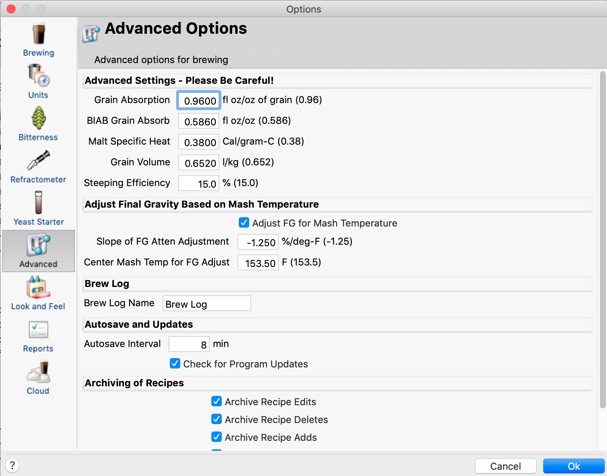
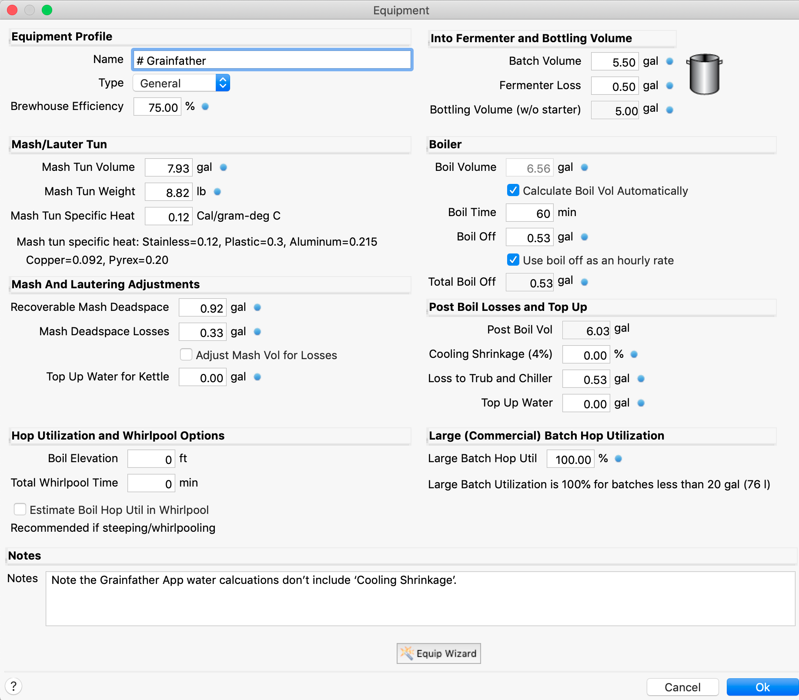
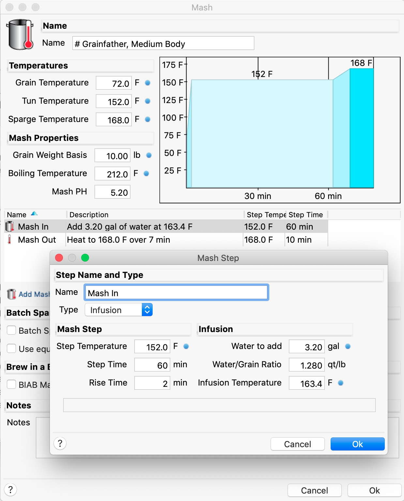
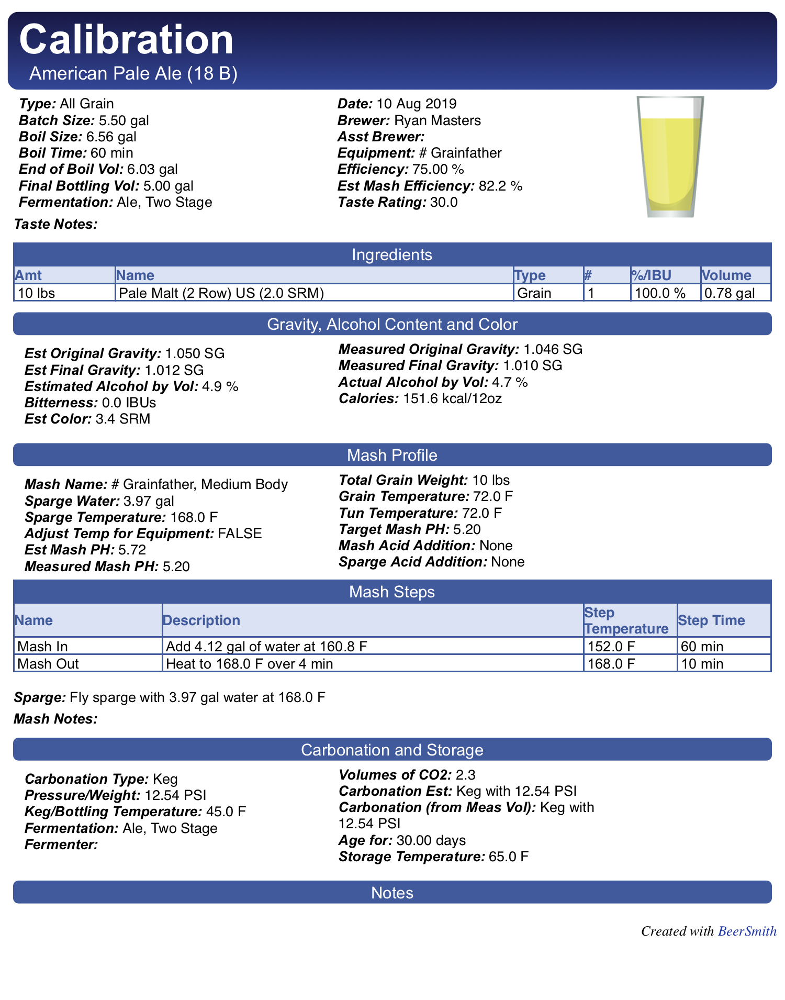
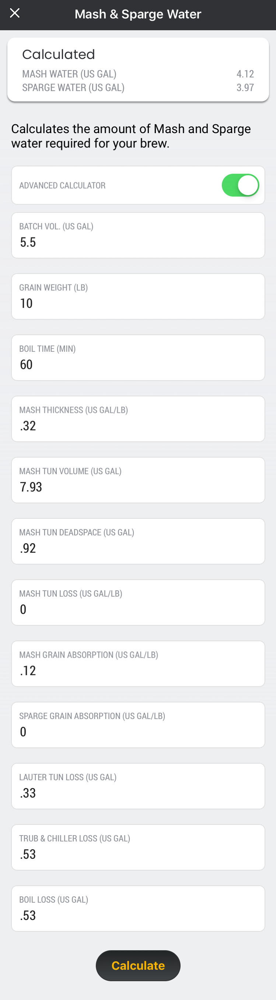
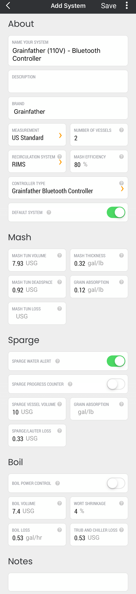
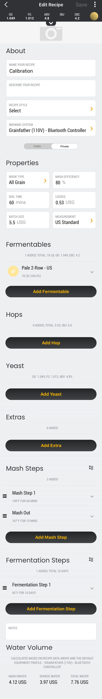

# **Beersmith Profile for the Grainfather**

---

## Introduction

---

I have been using BeerSmith to design recipes for my brewing equipment but I recently switched to a Grainfather.  I downloaded BeerSmith's Grainfather Equipment Add-on and found several online variations of the Grainfather Equipment but none matched the current Grainfather App.  After some adjustments in both pieces of software, I have an equipment profile that matches.

The goal is to share my profile and explain how the settings are linked between the two applications so you can adjust them to your liking.

In BeerSmith we will primarily be concerned with three sections.

1. Advanced Options
2. Equipment Profile
3. Mash Profile

In the Grainfather App we will be in three sections.

1. Equipment
2. Recipes
3. Mash And Sparge Water Calculator

At this time I'm using the following versions.

- BeerSmith 3.0.6 for Mac
- Grainfather Community 4.0.19 for iPhone

*Note: The Grainfather website can also be used, but some fields are in a different sections and some default values vary between the website and the app.*

---

## BeerSmith Profile

---

This document is intended to get the same results between the two applications.  If a BeerSmith setting isn't called out, it's not believed to have an influence on the consistency.

---

### Advanced Options

Go to Advanced Options in the BeerSmith Preferences Menu.

#### Grain Absorption

We are only interesting in the `Grain Absorption` value.  I used the default value in BeerSmith `0.9600` fl oz/oz of grain.

Watch the units and convert if when needed.  The Grainfather uses gal/lb so these numbers shouldn't match between the two applications.  This constant can vary depending on a number of factors.  Most sources suggest a ratio of 0.1 - 0.2 gal/lb.  The BeerSmith default is near the middle of this range at 0.12 gal/lb.  The Grainfather default is just below at 0.0959 gal/lb, but the Grainfather Mash And Sparge Water Calculator default is 0.1 gal/lb.

---

### BeerSmith Equipment Profile

Create a new Equipment profile for the Grainfather.

#### Batch Volume

I want a 5.00 gal bottling volume and I normally lose 0.5 gal in the fermenter so my `Batch Volume` is `5.50` gal. On the hot side, the Grainfather app doesn't account for Fermenter Loss and Bottling Volume.

#### Mash Tun Volume

This is the maximum size of your mash tun.  I used the `Mash Tun Volume` in the Grainfather App `7.93` gal.

#### Recoverable Deadspace

This is the volume of water not included in the mash below the false bottom.  I used the `Recoverable Deadspace` defined in the Grainfather App `0.92` gal.

#### Mash Deadspace Losses

I use a kettle to heat my sparge water and it doesn't drain completely.  I calculated my losses to be `0.33` gal and entered it in the `Mash Deadspace Losses` then I unchecked `Adjust Mash Vol for Losses` so the loss would be added to the sparge water.

#### Calculate Boil Vol Automatically

Sometimes I change my Batch Volume or Boil Time depending on my recipe.  Enable `Calculate Boil Vol Automatically` so you don't have to change the Boil Volume manually.

#### Boil Time

The standard `Boil Time` is `60` mins.  If you use something else your Boil Off volume may not match your Total Boil Off.

#### Boil Off

A lot of variables can influence your boil off rate.  I've measured mine anywhere between 0.5 - 1 gal/hr.  For now I used the `Boil Off` value in the Grainfather Equipment profile `0.53` gal.

#### Use boil off as an hourly rate

Same as the Boil Volume if you change your Boil Time you will want your `Boil off as an hourly rate` checked so it calculates automatically.

#### Cooling Shrinkage

`Cooling Shrinkage` is an interesting field.  I have gone back and forth between `0.00`% and `4.00`%.  The BeerSmith default is 4%. The Grainfather app calls it Wort Shrinkage and the default value is also 4%.  BeerSmith accounts for this by adding more water so you will hit your Batch Volume.  However, the Grainfather app, best I can tell, doesn't use this.  Maybe it's a bug?  What I have done is set the value to 0% to make sure the calculators match, then set it to 4% just to account for this small loss.

#### Loss to Trub and Chiller

The amount of wort left behind in the Grainfather and the chiller. The default `Loss to Trub and Chiller` in the Grainfather app is `0.53` gal.

---

### Mash Profile

You can make multiple mash profiles and there are a lot of variables here but only two have an effect on consistency.

#### Grain Weight Basis

I used `10.00` lb to as the `Grain Weight Basis` for my mash profile.  This makes some of the other calculations easier.  If your specific recipe has a grain weight higher or lower Beersmith will automatically adjust.

#### Water/Grain Ratio

Within the Mash Step settings the `Water/Grain Ratio` should be `1.280` qt/lb.  This value was taken directly from the Grainfather app, but watch out for the units.  The Grainfather app uses 0.32 gal/lb so if you glance at the numbers you may think they don't match.

---

## Check Your Work

---

By this point you should have completely setup BeerSmith.  Before setting up the Grainfather equipment, we will create a quick BeerSmith recipe and use the Grainfather Mash And Sparge Water Calculator to compare our numbers.

Create a simple recipe using the new equipment and mash profile with a 10 lb grain bill.

Then use the Mash & Sparge Water calculator to verify the two applications match at this preliminary stage.

---

## Grainfather Profile

---

Now that we have a BeerSmith equipment profile it's equally as important to have a matching Grainfather equipment profile.

---

### Grainfather Equipment Profile

Open the Grainfather app and create a new `Brewing Equipment System`.  I'm creating a Grainfather (110V) - Bluetooth Controller.  Not many settings need to be changed, but I won't go into detail about the default settings.

#### Number Of Vessels

I have a separate vessel to heat my sparge water so I increased my `Number Of Vessels` to `2`.

#### Grain Absorption

Using the `Grain Absorption` value from BeerSmith of 0.9600 fl oz/oz of grain this converts to `0.12` gal/lb.

#### Sparge Vessel Volume

The `Sparge Vessel Volume` is set to `10` gal because this is the maximum volume.

#### Sparge/Lauter Loss

When I completely drain my sparge water heater `0.33` gal is left behind so `Sparge/Lauter Loss` is set to match.

#### Boil Loss

Set the `Boil Loss` to `0.53` gal/hr. This is the Grainfather Equipment default but differs from the Mash and Sparge Water calculator.

#### Trub And Chiller Loss

Set the `Trub And Chiller Loss` to `0.53` gal/hr. This is the Grainfather Equipment default.

---

## Grainfather Recipe

---

So in keeping with checking your work.  Now you can create a recipe in the Grainfather app to verify the Water calculations match.  Create a new recipe, set the `Batch Size` to `5.5` gal. Then add `10` lbs of grain.  I added `Pale 2-Row - US`.

